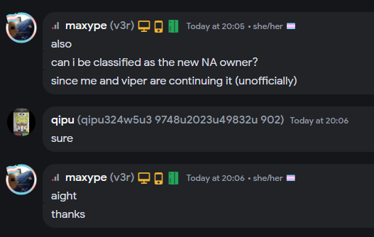

### Continuation of Nameless Admin (officially)


## Current Devs (AKA: new owners):
<div align="left">
  <a href="https://github.com/ltseverydayyou">
    
  </a>&#8203; 

  <a href="https://github.com/MuhXd">
    
  </a>&#8203;
</div>

## INFO
```
old scripts will be fixed and function properly
```
```
new cmds soon (if we're not lazy :P)
```


<div align="left">
  <a href="https://discord.gg/zS7TpV3p64">
    
  </a>&#8203;

  <a href="https://scriptblox.com/u/_null">
    
  </a>&#8203;

  <a href="https://scriptblox.com/u/Viper">
    
  </a>&#8203;


</div>

## Original Owner: 
<div align="left">
  <a href="https://github.com/FilteringEnabled">
    
  </a>&#8203; 

  <a href="https://github.com/lxte">
    
  </a>&#8203;
</div>

## Original Script: 
```lua
loadstring(game:HttpGet("https://github.com/FilteringEnabled/NamelessAdmin/blob/main/Source?raw=true"))()
```
